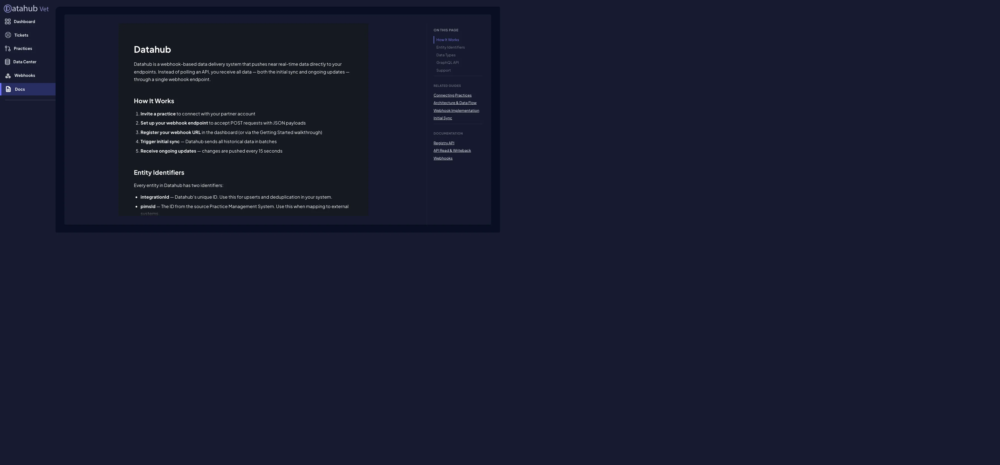
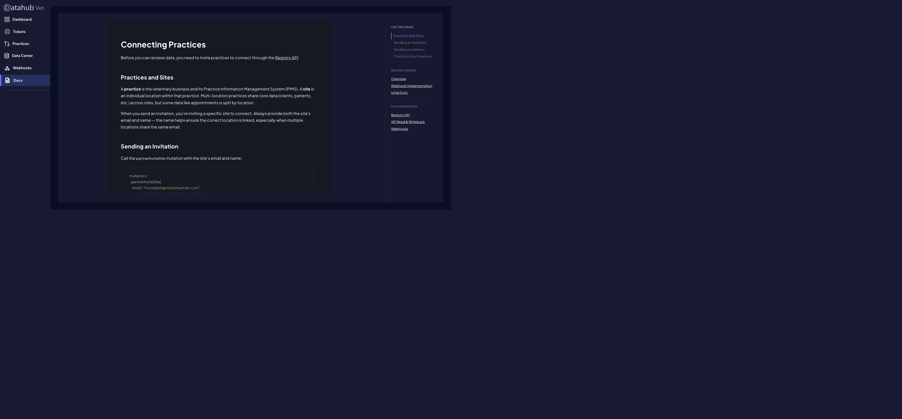
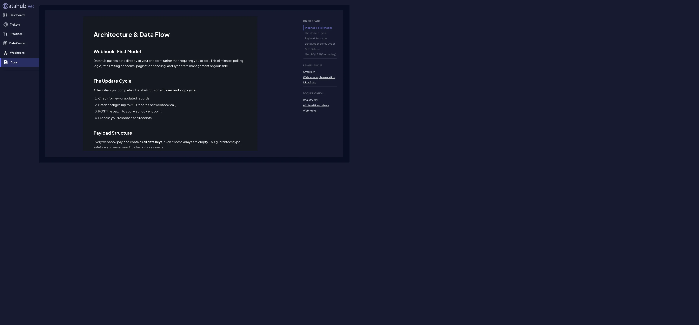
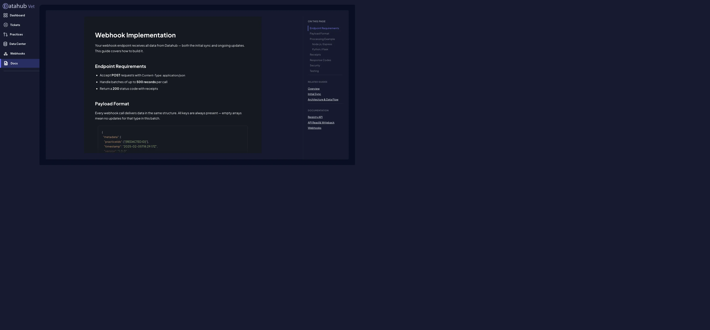
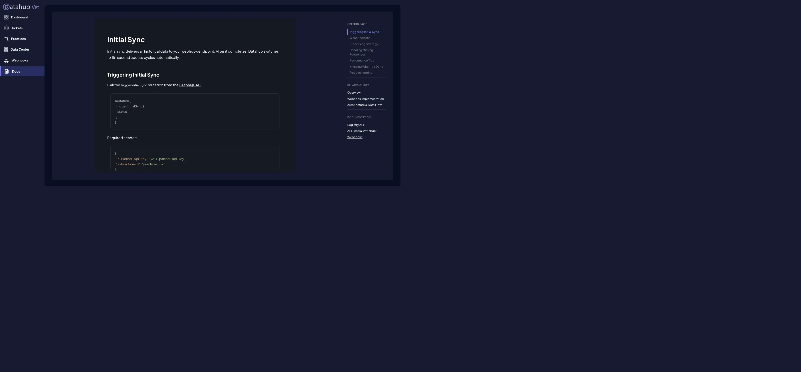
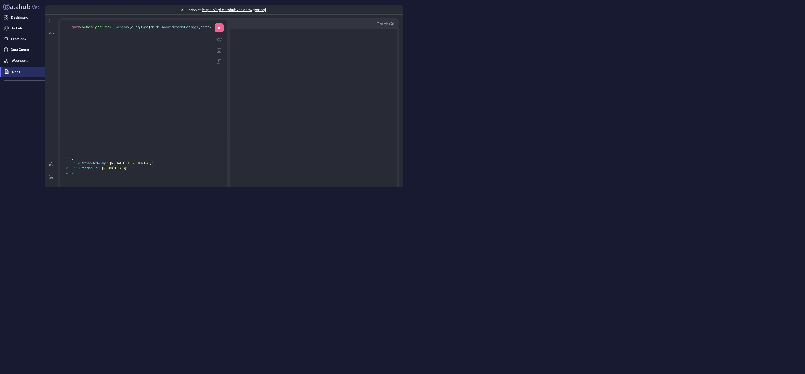
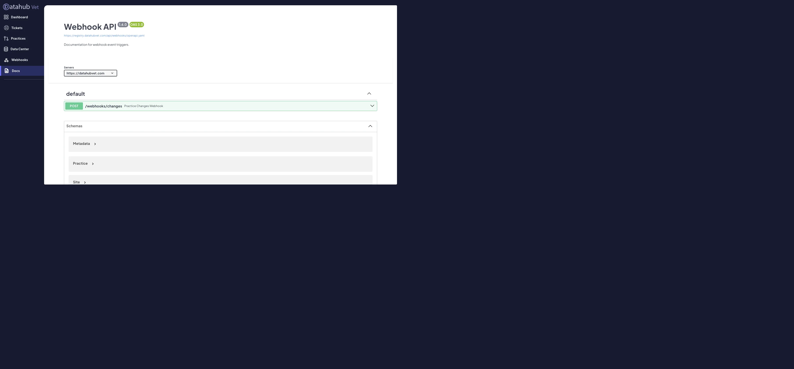
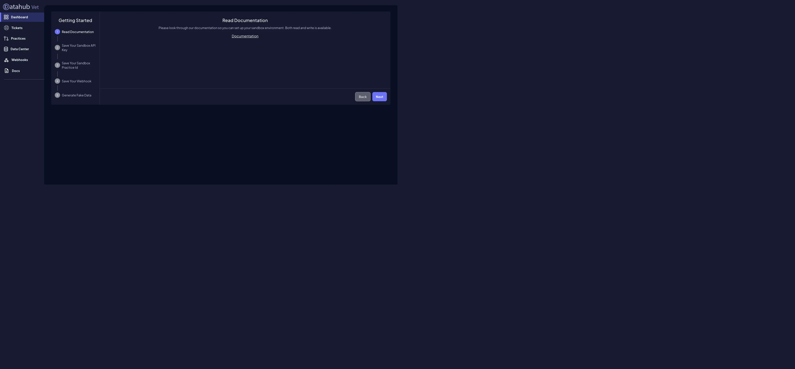
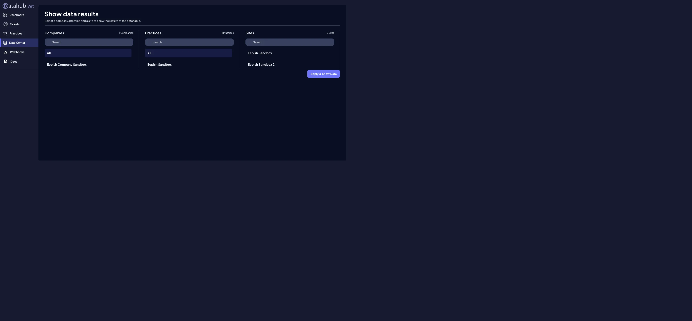

> **DO NOT DELETE:** This is the canonical Datahub and PIMS integration runbook for Vet.
> Keep it current when the receiver, Datahub configuration, credentials process, payload contract, or rollout state changes.

# Datahub PIMS Integration

Captured and verified against the live Datahub documentation and GraphQL schemas on 2026-08-04.
This is the working reference and rollout runbook for integrating Datahub with Vet.
Duplicate navigation text and repeated sample payloads were removed.
Operational wording, contracts, field names, and examples were retained.
Credentials, account details, tenant identifiers, and practice identifiers were removed.

## Bottom line

Datahub is a PIMS integration layer.
A veterinary practice connects its PIMS to Datahub once.
Datahub then sends Vet an initial historical export and near real-time changes through one webhook URL that Vet owns.
The expected ongoing cadence is about every 15 seconds.

The webhook is not a URL supplied by Datahub.
It is a public HTTPS `POST` endpoint in Vet that accepts Datahub's JSON, stores each entity idempotently, and returns one receipt for every received entity.

Vet now has a local implementation of that receiver:

- Receiver: `POST /api/integrations/datahub`
- Route: `apps/internal/app/api/integrations/datahub/route.ts`
- Validation and authentication: `apps/internal/app/api/integrations/datahub/_datahubWebhook.ts`
- Tenant-safe storage: `packages/db/src/datahub.ts`
- Database migration: `db/migrations/030_datahub_pims_ingestion.sql`
- Focused tests: `apps/internal/app/api/integrations/datahub/_datahubWebhook.test.ts`

Current proof level: merged, deployed, authenticated, sandbox-mapped, and exercised with live Datahub webhook traffic.
Production clinic onboarding and production PIMS traffic remain intentionally incomplete because they require a clinic invitation, approval, PIMS-provider confirmation, and pricing agreement.

## Live sandbox rollout on 2026-08-04

Completed actions:

- Merged PR `#106` after the no-mistakes gate, repository CI, CodeQL, dependency review, and external AI review passed.
- Deployed the merged receiver and migration to the approved Render service.
- Stored the dedicated webhook secret in the Mac Keychain under service `vet-datahub-webhook` and configured `DATAHUB_WEBHOOK_SECRET` on Render.
- Proved the public receiver returns `401` without authentication and `400` for an authenticated malformed JSON payload.
- Created an isolated hidden clinic tenant named `datahub-sandbox` with no public hostname.
- Mapped the Datahub sandbox practice only to that tenant.
- Registered `Vet sandbox ingestion` as an active Datahub sandbox webhook.
- Configured `X-Datahub-Webhook-Secret` as a custom header without exposing its value.
- Enabled every data category offered by the Datahub webhook form.
- Generated all fake-data categories offered by the Getting Started workflow.
- Triggered `triggerInitialSync` through the API GraphQL endpoint and received `Success`.
- Stored the replacement partner key in the Mac Keychain under service `datahubvet-partner-api`.
- Stored the sandbox practice identifier in the Mac Keychain under service `datahubvet-sandbox-practice`.

Live data proof after fake data and initial sync:

- Webhook deliveries: `3`.
- Received entity receipts: `513`.
- Successful entity receipts: `511`.
- Failed entity receipts: `2`.
- Unique tenant-scoped records stored: `491`.
- Initial sync added one new practice-authorization record and no new failures.
- Connection status: `active`.
- Initial-sync timestamp: recorded.
- Last-webhook timestamp: recorded.

The two failures came from the fake generator's `patientReminders` category.
Every other selected fake-data category stored successfully.
The two reminder objects did not provide a stable `integrationId` or `id`, so Vet correctly returned failure receipts instead of inventing an unsafe identity.
No Datahub retry arrived during the observation window.

Security result:

- The screenshots exposed the previous partner key.
- The Registry API `partnerRekey` mutation returned a replacement key, and the replacement was verified against `partnerPractices`.
- Datahub continued accepting the previous key immediately after rekey while the dashboard displayed its cached value.
- After propagation, the previous key was rejected, the replacement was accepted, and the two values were verified to differ.
- The inbound webhook does not use the partner key, so partner-key rotation does not interrupt webhook delivery.

## What to do, in order

### 0. Rotate the exposed partner API key

The supplied screenshots visibly contained the full partner API key.
Treat that key as compromised.
The Registry API `partnerRekey` mutation was executed on 2026-08-04.
The replacement works and is stored in the approved Keychain location.
The previous key remained accepted briefly during propagation and was then verified as rejected.

After rotation:

- Store the replacement partner key only in the approved secret manager.
- Never place the partner key in this file, source code, Git history, logs, screenshots, or client-side JavaScript.
- Use a separate random webhook secret for inbound webhook authentication.
- Configure that dedicated secret as `DATAHUB_WEBHOOK_SECRET` on the Vet server.

### 1. Apply the database migration

Apply `db/migrations/030_datahub_pims_ingestion.sql` to the intended Vet database through the repository migration command.
Do not apply it until the target database and tenant are confirmed.

The migration creates:

- `pims_connections`: Datahub practice to Vet clinic mapping.
- `pims_webhook_deliveries`: delivery audit and receipt counts without duplicating the raw batch.
- `pims_records`: tenant-scoped idempotent storage for every Datahub entity.

### 2. Create the Datahub practice mapping

Before accepting a webhook, map the Datahub practice ID to exactly one Vet clinic.
This prevents one clinic's PIMS data from entering another clinic's tenant.

```sql
insert into pims_connections (
  clinic_id,
  provider,
  provider_practice_id,
  provider_site_ids,
  status
)
values (
  '<vet-clinic-uuid>',
  'datahub',
  '<datahub-practice-uuid>',
  array['<datahub-site-uuid>'],
  'pending'
);
```

Use sandbox IDs first.
Do not reuse a practice mapping across Central Veterinary Hospital and Tri-City Veterinary Hospital.

### 3. Deploy the receiver

Deploy the Vet app with:

- `DATABASE_URL`
- `DATAHUB_WEBHOOK_SECRET`

Resulting URL shape:

```text
https://<approved-vet-host>/api/integrations/datahub
```

The URL must be public HTTPS and must accept `Content-Type: application/json`.

### 4. Register the webhook in Datahub

Simplest path:

1. Open Datahub.
2. Open **Webhooks**.
3. Select **Sandbox**.
4. Select **Add Webhook**.
5. Enter the deployed Vet receiver URL.
6. Add request header `X-Datahub-Webhook-Secret` with the same value as `DATAHUB_WEBHOOK_SECRET`.
7. Enable the desired entity types.
8. Save the webhook.

Registry GraphQL alternative:

```graphql
mutation RegisterVetWebhook($url: String!, $secret: String!) {
  createPartnerHook(
    partnerHook: {
      name: "Vet sandbox"
      url: $url
      isSandbox: true
      isActive: true
      headers: [
        { name: "X-Datahub-Webhook-Secret", value: $secret }
      ]
      sendPractice: true
      sendSpecies: true
      sendBreed: true
      sendSex: true
      sendAppointmentStatus: true
      sendAppointmentType: true
      sendAppointment: true
      sendBlockoff: true
      sendClient: true
      sendClientEmail: true
      sendClientPhoneNumber: true
      sendEmployee: true
      sendCurrency: true
      sendTimezone: true
      sendOwnership: true
      sendPatient: true
      sendPatientReminder: true
      sendResource: true
    }
  ) {
    id
    name
    url
    isActive
    isSandbox
  }
}
```

Required Registry API request header:

```json
{
  "X-Partner-Api-Key": "<partner-api-key>"
}
```

Important schema inconsistency:
The live `CreatePartnerHookInput` exposes flags for the older core entity set but does not expose flags for newer payload groups such as transactions, SOAP notes, services, hours, shifts, and resource shifts.
Use the dashboard if it exposes those choices.
Otherwise ask Datahub whether the additional arrays are always delivered or require vendor-side enablement.

### 5. Generate sandbox data

Use Datahub's Getting Started walkthrough:

1. Read Documentation.
2. Save Your Sandbox API Key.
3. Save Your Sandbox Practice ID.
4. Save Your Webhook.
5. Generate Fake Data.

Expected Vet behavior:

- HTTP status: `200`
- Response body: one receipt per received entity
- `pims_webhook_deliveries.status`: `processed` or `partial`
- Records stored in `pims_records`
- `pims_connections.status`: `active`

### 6. Trigger sandbox initial sync

Call the API GraphQL mutation:

```graphql
mutation {
  triggerInitialSync {
    status
  }
}
```

Required API headers:

```json
{
  "X-Partner-Api-Key": "<partner-api-key>",
  "X-Practice-Id": "<datahub-practice-uuid>"
}
```

API endpoint:

```text
https://api.datahubvet.com/graphql
```

### 7. Prove the sandbox result

Do not treat a successful mutation response as completed sync proof.
Verify all of the following:

- Large historical batches arrived.
- Every entity produced a receipt.
- Failed receipts were retried and eventually succeeded or have an actionable reason.
- Duplicate delivery does not create duplicate records.
- Older deliveries do not overwrite newer stored state.
- Soft-deleted records remain stored with deletion flags.
- The delivery rate drops to normal incremental traffic.
- New fake changes arrive on the expected 15-second cycle.
- Records remain scoped to the intended Vet clinic.
- No raw payload or personal data appears in application logs.

### 8. Invite a real practice site

Only after sandbox proof, invite the exact clinic site.
Use both the site email and site name because multi-location practices can share an email address.

```graphql
mutation {
  partnerInviteSite(
    email: "frontdesk@mainstreetvet.com"
    practiceOrSiteName: "Main Street Veterinary"
  ) {
    id
    isSuccess
    message
  }
}
```

The site receives an email and completes its Datahub/PIMS onboarding.
After approval, query `partnerPractices`, add the new production practice mapping, register a production webhook, and repeat the proof sequence.

### 9. Add product-facing PIMS adapters

The receiver currently preserves Datahub records in a stable provider-neutral store.
It does not yet replace Vet's existing mock clinic data or write external PIMS data into product-specific tables.

Add explicit adapters only after real sandbox payloads prove the shape needed by each product flow.
Likely first adapters:

- Client and patient lookup
- Appointments and appointment status
- Resources and schedules
- SOAP notes and service history
- Transactions and balances
- Patient reminders

Keep Datahub `integrationId` as the stable upsert and deduplication key.
Keep `pimsId` for mapping back to the source PIMS.
When both copies have a provider update time, keep the newer `updatedAt` or `pimsUpdatedAt` value.
When either copy lacks that field, use the webhook metadata timestamp to prevent an older delivery from replacing newer stored state.

### 10. Send the factual rollout update

Send the requested email only after the applicable sandbox or production proof above is complete.
State the exact environment, clinic mapping, webhook registration, sync result, incremental-update proof, retry proof, and any remaining blocker.
Do not describe source or local proof as a completed external rollout.

## What a webhook is

A webhook is an incoming server-to-server HTTP request.
Datahub is the caller and Vet is the receiver.

```text
Practice PIMS
  -> Datahub connector
  -> Datahub normalizes and batches records
  -> POST https://<vet-host>/api/integrations/datahub
  -> Vet validates the secret and practice mapping
  -> Vet upserts records by integrationId
  -> Vet returns per-entity receipts with HTTP 200
  -> Datahub retries only failed entities
```

This differs from polling.
Vet does not repeatedly ask Datahub whether anything changed.
Datahub sends changes when they are available.

The same webhook receives both:

- Initial sync: all historical records in multiple batches.
- Ongoing sync: new and updated records on roughly 15-second cycles.

## Datahub overview

Datahub is a webhook-based data delivery system that pushes near real-time data directly to your endpoints.
Instead of polling an API, you receive all data, both the initial sync and ongoing updates, through a single webhook endpoint.

### How it works

1. Invite a practice to connect with your partner account.
2. Set up your webhook endpoint to accept POST requests with JSON payloads.
3. Register your webhook URL in the dashboard or through the Getting Started walkthrough.
4. Trigger initial sync.
5. Datahub sends all historical data in batches.
6. Receive ongoing updates every 15 seconds.

### Entity identifiers

Every entity has two important identifiers:

- `integrationId`: Datahub's unique ID, used for upserts and deduplication.
- `pimsId`: The ID from the source Practice Information Management System, used when mapping to external systems.

```json
{
  "integrationId": "abc123",
  "pimsId": "PIMS-456",
  "name": "Fluffy",
  "owner": {
    "integrationId": "owner-789",
    "pimsId": "PIMS-OWNER-101"
  }
}
```

### Data types

Datahub documents these webhook data types:

- Species, breeds, and sexes
- Clients, client phone numbers, and client emails
- Patients and ownership relationships
- Appointments, appointment types, and appointment statuses
- Employees and resources
- Blockoffs and resource blockoffs
- Patient reminders
- Transactions, transaction statuses, and transaction types
- Service codes, service histories, and service types
- SOAP notes
- Hours of operation
- Practice authorizations
- Currencies and timezones
- Shifts and resource shifts in the current OpenAPI schema

`invoices` remains present but is deprecated and returns an empty array.

### GraphQL role

Webhooks handle bulk data delivery.
The API GraphQL endpoint handles targeted reads and write operations such as creating clients, patients, appointments, transactions, and SOAP notes.

## Connecting practices

Before receiving data, invite practices through the Registry API.

### Practices and sites

A practice is the veterinary business and its PIMS.
A site is an individual location within that practice.
Multi-location practices share core data such as clients and patients across sites.
Some data such as appointments is split by location.

An invitation targets a specific site.
Always provide both the site's email and name to reduce incorrect location linkage.

### Production invitation

```graphql
mutation {
  partnerInviteSite(
    email: "frontdesk@mainstreetvet.com"
    practiceOrSiteName: "Main Street Veterinary"
  ) {
    id
    isSuccess
    message
  }
}
```

Datahub sends the invitation email and handles onboarding.
After connection, the practice and site appear in the partner account.

### Sandbox invitation

Sandbox invitations connect instantly with no approval step.

```graphql
mutation {
  partnerInviteSite(
    email: "test@example.com"
    isSandbox: true
  ) {
    id
    isSuccess
    message
  }
}
```

The Getting Started walkthrough can also provision a sandbox.

### Check connected practices

```graphql
query {
  partnerPractices {
    id
    name
    integration
    email
    accessGrantedAt
    invitationId
    sites {
      id
      name
      invitationId
    }
  }
}
```

Once a practice appears, register its webhook and trigger initial sync.

## Architecture and data flow

### Webhook-first model

Datahub pushes data directly to the receiver instead of requiring polling.
This removes polling logic, rate-limit concerns, pagination handling, and most external sync-state management from Vet.

### Update cycle

After initial sync, Datahub runs a 15-second loop:

1. Check for new or updated records.
2. Batch changes, up to 500 records per webhook call.
3. POST the batch to the registered webhook.
4. Process the receiver response and receipts.

### Payload structure

Every payload includes all data keys.
An empty array means there were no updates for that entity type in the batch.

```json
{
  "metadata": {
    "practiceIds": ["<practice-uuid>"],
    "timestamp": "2025-02-05T18:29:17Z",
    "version": "1.0.0"
  },
  "data": {
    "species": [],
    "breeds": [],
    "sexes": [],
    "clients": [],
    "clientPhoneNumbers": [],
    "clientEmails": [],
    "patients": [],
    "ownerships": [],
    "appointments": [],
    "appointmentTypes": [],
    "appointmentStatuses": [],
    "employees": [],
    "resources": [],
    "blockoffs": [],
    "resourceBlockoffs": [],
    "patientReminders": [],
    "transactions": [],
    "transactionStatuses": [],
    "transactionTypes": [],
    "soapNotes": [],
    "serviceCodes": [],
    "serviceHistories": [],
    "serviceTypes": [],
    "hoursOfOperation": [],
    "practiceAuthorizations": [],
    "currencies": [],
    "timezones": [],
    "invoices": [],
    "shifts": [],
    "resourceShifts": []
  }
}
```

### Dependency order

Foundation:

- Species
- Sexes
- Appointment types
- Appointment statuses
- Transaction statuses and transaction types
- Service types and service codes
- Currencies and timezones
- Hours of operation

Dependent:

- Breeds reference species.
- Resources can reference employees.
- Employees
- Clients

Complex relationships:

- Patients reference species, breeds, and sexes.
- Ownerships reference clients and patients.
- Appointments reference clients, patients, resources, statuses, and types.
- Transactions reference clients, patients, employees, resources, currencies, statuses, and types.
- Service histories reference patients, clients, resources, service codes, and service types.
- Practice authorizations reference practices.
- Blockoffs and resource blockoffs reference resources.
- Resource shifts reference shifts and resources.

Vet's receiver stores raw normalized entities without hard foreign keys between entity types.
This tolerates temporarily missing references and allows later adapters to resolve relationships after all batches arrive.

### Soft deletes

Deleted records are not omitted.
Check:

- `isActive`: whether the record remains visible in the source database.
- `isDeleted`: whether it is no longer visible in the source database.
- `deletedAt`: when deletion was detected.

Do not physically delete a local record merely because a later payload marks it deleted.
Preserve the record and its deletion metadata for auditing and reconciliation.

## Webhook implementation contract

### Endpoint requirements

- Accept `POST` requests.
- Require `Content-Type: application/json`.
- Handle up to 500 records per call.
- Authenticate the incoming request.
- Return HTTP `200` with one receipt for each received entity.

### Receipt format

```json
[
  {
    "type": "Appointment",
    "id": "a6dadc45-6b3d-4654-959b-c7327fa99f16",
    "success": true,
    "error": ""
  },
  {
    "type": "Client",
    "id": "b7e1c2d3-4f5a-6789-b012-3456789abcde",
    "success": false,
    "error": "Failed to process client data"
  }
]
```

Failed entities are retried by Datahub.
Always return `200` when the batch was understood, even when individual entities failed.
Use receipts to report individual failures.

Response meanings:

- `200`: Correct response for a parsed batch, including partial entity failures.
- `400`: Invalid payload format and should be rare.
- `401`: Incoming secret is missing or incorrect.
- `415`: Request is not JSON.
- `500`: Entire endpoint failed and may cause a full batch retry.
- `503`: Receiver configuration or practice mapping is not ready.

### Security

Datahub documentation states that it can send the partner API key in request headers.
Vet should instead use the hook's configurable headers to send a dedicated inbound secret.
The implementation uses constant-time secret comparison.
It accepts `X-Datahub-Webhook-Secret` as the preferred header and `X-Partner-Api-Key` only as a compatibility header; either header value must equal `DATAHUB_WEBHOOK_SECRET`, never the Datahub partner API key.

Additional production controls:

- Store secrets only in server-side environment configuration.
- Keep the endpoint out of browser/client bundles.
- Add vendor IP allowlisting only after Datahub supplies stable documented ranges.
- Rate-limit abusive invalid requests without delaying valid Datahub traffic.
- Do not log headers or raw payloads.
- Encrypt database storage and backups.
- Define retention for PII, clinical data, and audit records.

### Datahub's simple Node example

```js
app.post("/datahub-webhook", express.json(), (req, res) => {
  const { data } = req.body;
  const receipts = [];

  for (const client of data.clients) {
    try {
      upsertClient(client);
      receipts.push({ type: "Client", id: client.integrationId, success: true, error: "" });
    } catch (error) {
      receipts.push({ type: "Client", id: client.integrationId, success: false, error: error.message });
    }
  }

  for (const patient of data.patients) {
    try {
      upsertPatient(patient);
      receipts.push({ type: "Patient", id: patient.integrationId, success: true, error: "" });
    } catch (error) {
      receipts.push({ type: "Patient", id: patient.integrationId, success: false, error: error.message });
    }
  }

  res.status(200).json(receipts);
});
```

Vet's implementation improves on this sample by adding tenant mapping, constant-time authentication, schema validation, future entity compatibility, group transactions, idempotent keys, delivery audits, and partial receipts.

## Initial sync

Initial sync sends all historical data to the same webhook endpoint.
After completion, Datahub switches automatically to ongoing update cycles.

### What happens

1. Datahub collects historical data for the practice.
2. Data is organized in dependency order.
3. Batches of up to 500 records are sent to the webhook.
4. Deliveries continue until all data is synced.
5. Ongoing 15-second update cycles begin.

### Processing strategy

- Use bulk inserts and upserts.
- Use transactions per entity group or batch.
- Return receipts quickly.
- Move expensive derived work to asynchronous jobs.
- Monitor memory and database load during large syncs.
- Create placeholder references or defer joins when a referenced entity has not arrived.
- Return a successful ingestion receipt after durable raw storage rather than failing an entity solely because a relationship is not resolved yet.

### Knowing when it is done

The documentation does not expose a definitive completion event in the shown webhook contract.
Documented indicators:

- Webhook frequency settles into the normal cycle.
- Batch sizes become small incremental updates instead of historical bulk batches.

For production reliability, ask Datahub whether `InitialSyncStatus` exposes a durable completion state or whether a status query/webhook exists.

### Troubleshooting

- Sync seems stuck: inspect receiver status and failed receipts.
- Missing data: confirm a success receipt was returned for each durable entity.
- Timeouts: shorten synchronous processing and queue downstream work.
- Need to resync: call `triggerInitialSync` again after fixing the receiver.

## Live GraphQL schema findings

These actions were confirmed through read-only introspection of the live schemas.
No clinic records were queried or modified.

### Registry API

Endpoint:

```text
https://registry.datahubvet.com/graphql
```

Relevant queries:

- `partnerPractices`
- `partnerHooks`

Relevant mutations:

- `partnerInviteSite(email, practiceOrSiteName, isSandbox)`
- `partnerInvitePractice(email, practiceOrSiteName, isSandbox)`
- `createPartnerHook(partnerHook)`
- `updatePartnerHook(partnerHook)`
- `removePartnerHook`

`CreatePartnerHookInput` requires `name` and `url`.
It also supports `isSandbox`, `isActive`, `practiceId`, `partnerId`, custom `headers`, `parser`, and entity send flags.
Each custom header has required `name` and `value` fields.

### API read and writeback

Endpoint:

```text
https://api.datahubvet.com/graphql
```

Confirmed queries:

- `hello`
- `patientReminders`
- `client`
- `clients`
- `patients`
- `practiceStatus`
- `appointments`
- `blockoffs`
- `resources`
- `appointmentTypes`
- `transactions`
- `serviceHistories`
- `soapNotes`
- `hoursOfOperation`
- `availability`
- `practiceHealth`
- `breeds`
- `species`
- `sexes`

Confirmed mutations:

- `createClient`
- `updateClient`
- `createPatient`
- `updatePatient`
- `createAppointment`
- `updateAppointment`
- `createTransaction`
- `updateTransaction`
- `createSoapNote`
- `updateSoapNote`
- `triggerInitialSync`

The `triggerInitialSync` mutation currently also accepts optional filters:

- `entityType`
- `updatedAfter`
- `updatedBefore`
- `effectiveAfter`
- `effectiveBefore`

Use writeback only after the read and webhook identity mapping is proven.
Writeback changes the clinic's source PIMS and therefore requires explicit product behavior, authorization, validation, idempotency, and audit design.

## OpenAPI webhook schema

OpenAPI source:

```text
https://registry.datahubvet.com/api/webhooks/openapi.yaml
```

Observed version: `1.6.0`, OpenAPI `3.0`.
Documented event: `POST /webhooks/changes`, Practice Changes Webhook.
The example server shown by Swagger is `https://datahubvet.com`.
For this integration, Datahub calls Vet's registered URL rather than Vet calling `/webhooks/changes` on Datahub.

### Complete data collection inventory

- `practiceAuthorizations`
- `species`
- `breeds`
- `sexes`
- `appointmentStatuses`
- `appointmentTypes`
- `currencies`
- `employees`
- `timezones`
- `resources`
- `clients`
- `clientPhoneNumbers`
- `clientEmails`
- `patients`
- `ownerships`
- `appointments`
- `blockoffs`
- `resourceBlockoffs`
- `patientReminders`
- `transactions`
- `transactionTypes`
- `transactionStatuses`
- `invoices`
- `soapNotes`
- `serviceHistories`
- `serviceCodes`
- `serviceTypes`
- `hoursOfOperation`
- `shifts`
- `resourceShifts`

### Schema field inventory

An asterisk in Swagger means required.
Nullability still needs to be handled defensively because source PIMS quality varies.

#### Metadata

`practiceIds`, `timestamp`, `version`

#### Practice

`id`, `name`, `isActive`, `isSandbox`, `createdAt`, `updatedAt`, `clusterUrl`, `integrationId`, `email`, `sites`, `invitationId`

#### Site

`id`, `integrationId`, `name`, `isActive`, `isSandbox`, `practiceId`, `createdAt`, `updatedAt`, `invitationId`

#### PracticeAuthorization

`id`, `practiceId`, `isEnabled`, `practice`

#### Species

`type`, `createdAt`, `deletedAt`, `pimsId`, `siteId`, `id`, `integration`, `integrationId`, `isActive`, `isDeleted`, `name`, `practiceId`, `updatedAt`

#### Breed

`type`, `siteId`, `pimsId`, `pimsSpeciesId`, `speciesId`, `createdAt`, `deletedAt`, `id`, `integration`, `integrationId`, `isActive`, `isDeleted`, `name`, `practiceId`, `updatedAt`

#### Sex

`type`, `createdAt`, `deletedAt`, `pimsId`, `siteId`, `id`, `integration`, `integrationId`, `isActive`, `isDeleted`, `name`, `practiceId`, `speciesId`, `updatedAt`

#### AppointmentStatus

`pimsId`, `createdAt`, `deletedAt`, `iconName`, `id`, `integration`, `integrationId`, `isActive`, `siteId`, `isDeleted`, `name`, `practiceId`, `sequence`, `updatedAt`

#### AppointmentType

`type`, `pimsId`, `backgroundColor`, `color`, `createdAt`, `defaultDuration`, `deletedAt`, `excludeFromAutomaticSmsSend`, `id`, `integration`, `integrationId`, `isActive`, `isBoarding`, `isDeleted`, `name`, `siteId`, `practiceId`, `updatedAt`

#### Currency

`type`, `createdAt`, `deletedAt`, `pimsId`, `siteId`, `id`, `integration`, `integrationId`, `isActive`, `isDeleted`, `key`, `name`, `practiceId`, `updatedAt`

#### Employee

`type`, `firstName`, `lastName`, `email`, `pimsId`, `siteId`, `id`, `integration`, `integrationId`, `isActive`, `isDeleted`, `practiceId`, `updatedAt`, `createdAt`, `deletedAt`

#### Timezone

`type`, `createdAt`, `deletedAt`, `pimsId`, `siteId`, `id`, `integration`, `integrationId`, `isActive`, `isDeleted`, `key`, `name`, `practiceId`, `updatedAt`

#### Resource

`type`, `name`, `siteId`, `employeeId`, `pimsId`, `pimsEmployeeId`, `id`, `integration`, `integrationId`, `isActive`, `isDeleted`, `practiceId`, `updatedAt`, `createdAt`, `deletedAt`

#### Client

`type`, `firstName`, `lastName`, `pimsId`, `siteId`, `balance`, `clientStatus`, `discount`, `id`, `integration`, `integrationId`, `isActive`, `isDeleted`, `practiceId`, `updatedAt`, `address`, `addressExtended`, `city`, `zipcode`, `state`, `country`, `createdAt`, `deletedAt`

#### ClientPhoneNumber

`type`, `clientId`, `phoneNumber`, `displayPhoneNumber`, `pimsId`, `pimsClientId`, `siteId`, `id`, `integration`, `integrationId`, `isActive`, `isDeleted`, `isPrimary`, `practiceId`, `updatedAt`, `createdAt`, `deletedAt`

#### ClientEmail

`type`, `clientId`, `email`, `pimsId`, `pimsClientId`, `siteId`, `id`, `integration`, `integrationId`, `isActive`, `isDeleted`, `isPrimary`, `practiceId`, `updatedAt`, `createdAt`, `deletedAt`

#### Patient

`type`, `allergies`, `birthdate`, `pimsId`, `siteId`, `pimsSpeciesId`, `pimsBreedId`, `pimsSexId`, `pimsClientId`, `breedId`, `color`, `createdAt`, `deletedAt`, `id`, `integration`, `integrationId`, `isActive`, `isAgeEstimate`, `isDeleted`, `isMixedBreed`, `isWeightEstimate`, `name`, `practiceId`, `updatedAt`, `markings`, `microchip`, `patientStatus`, `rabiesId`, `secondBreedId`, `sexId`, `speciesId`, `thirdBreedId`, `weight`, `weightUnit`, `isDeceased`

#### Ownership

`type`, `clientId`, `patientId`, `pimsId`, `pimsClientId`, `pimsPatientId`, `siteId`, `percentage`, `relationship`, `id`, `integration`, `integrationId`, `isActive`, `isDeleted`, `practiceId`, `createdAt`, `updatedAt`, `deletedAt`, `patient`

#### Appointment

`type`, `pimsId`, `pimsClientId`, `pimsPatientId`, `pimsAppointmentStatusId`, `pimsAppointmentTypeId`, `pimsResourceId`, `appointmentStatusId`, `appointmentTypeId`, `clientId`, `patientId`, `startsAt`, `endsAt`, `resourceId`, `reason`, `notes`, `createdAt`, `deletedAt`, `id`, `integration`, `integrationId`, `isActive`, `siteId`, `isDeleted`, `practiceId`, `updatedAt`, `room`

#### Blockoff

`type`, `createdAt`, `startsAt`, `endsAt`, `id`, `integration`, `integrationId`, `isActive`, `isDeleted`, `isException`, `isRepeating`, `notes`, `siteId`, `pimsId`, `pimsResourceId`, `pimsType`, `pimsUpdatedAt`, `practiceId`, `reason`, `rrule`, `updatedAt`, `deletedAt`

#### ResourceBlockoff

`type`, `blockoffId`, `resourceId`, `pimsId`, `pimsCreatedAt`, `pimsUpdatedAt`, `siteId`, `id`, `integration`, `integrationId`, `isActive`, `isDeleted`, `practiceId`, `updatedAt`, `createdAt`, `deletedAt`

#### PatientReminder

`type`, `clientId`, `pimsId`, `siteid`, `createdAt`, `deletedAt`, `description`, `due`, `lastGiven`, `employeeId`, `id`, `integration`, `integrationId`, `isActive`, `isDeleted`, `isSatisfied`, `numberOfDays`, `patientId`, `practiceId`, `reminderType`, `siteId`, `updatedAt`

The schema includes both `siteid` and `siteId`.
Treat `siteId` as canonical while tolerating `siteid` during ingestion.

#### Transaction

`amount`, `clientId`, `createdAt`, `createdBy`, `currencyId`, `date`, `deletedAt`, `discountAmount`, `discountType`, `due`, `employeeId`, `entity`, `id`, `integration`, `integrationId`, `invoiceNumber`, `isActive`, `isComplete`, `isDeleted`, `isPaid`, `linkedInvoiceId`, `originalTransactionId`, `paymentMethod`, `pimsClientId`, `pimsCreatedAt`, `pimsDeletedAt`, `pimsId`, `pimsUpdatedAt`, `practiceId`, `processedAt`, `referenceNumber`, `remainingBalance`, `resourceId`, `siteId`, `taxAmount`, `transactionMemo`, `transactionStatusId`, `transactionTypeId`, `updatedAt`, `updatedBy`

#### TransactionType

`createdAt`, `name`, `deletedAt`, `entity`, `id`, `integration`, `integrationId`, `isActive`, `isDeleted`, `pimsCreatedAt`, `pimsDeletedAt`, `pimsId`, `pimsUpdatedAt`, `practiceId`, `siteId`, `updatedAt`, `updatedBy`

#### TransactionStatus

`createdAt`, `name`, `deletedAt`, `entity`, `id`, `integration`, `integrationId`, `isActive`, `isDeleted`, `pimsCreatedAt`, `pimsDeletedAt`, `pimsId`, `pimsUpdatedAt`, `practiceId`, `siteId`, `updatedAt`, `updatedBy`

#### Invoice

Deprecated sentinel fields: `type`, `message`.
The documented message says this item is deprecated and will only return an empty array.

#### SoapNote

`type`, `assessmentRtf`, `assessmentText`, `clientId`, `createdAt`, `deletedAt`, `employeeId`, `enteredAt`, `id`, `integration`, `integrationId`, `isActive`, `isDeleted`, `isLocked`, `notesRtf`, `notesText`, `objectiveRtf`, `objectiveText`, `patientId`, `pimsCreatedAt`, `pimsDeletedAt`, `pimsId`, `pimsUpdatedAt`, `planRtf`, `planText`, `practiceId`, `resourceId`, `siteId`, `subjectiveRtf`, `subjectiveText`, `updatedAt`, `workstationId`

#### ServiceHistory

`type`, `id`, `practiceId`, `siteId`, `integration`, `integrationId`, `patientId`, `clientId`, `resourceId`, `serviceCodeId`, `serviceTypeId`, `createdById`, `description`, `entity`, `amount`, `quantity`, `administeredAt`, `createdAt`, `updatedAt`, `deletedAt`, `pimsId`, `pimsCreatedAt`, `pimsUpdatedAt`, `pimsDeletedAt`, `isActive`, `isDeleted`

#### ServiceCode

`type`, `id`, `practiceId`, `siteId`, `integration`, `integrationId`, `name`, `entity`, `createdAt`, `updatedAt`, `deletedAt`, `pimsId`, `pimsCreatedAt`, `pimsUpdatedAt`, `pimsDeletedAt`, `isActive`, `isDeleted`

#### ServiceType

`type`, `id`, `practiceId`, `siteId`, `integration`, `integrationId`, `name`, `entity`, `createdAt`, `updatedAt`, `deletedAt`, `pimsId`, `pimsCreatedAt`, `pimsUpdatedAt`, `pimsDeletedAt`, `isActive`, `isDeleted`

#### HoursOfOperation

`type`, `createdAt`, `deletedAt`, `id`, `integration`, `isActive`, `isDeleted`, `practiceId`, `siteId`, `updatedAt`, `dayOfWeek`, `opensAt`, `closesAt`, `openingTime`, `closingTime`, `startingOn`, `endingOn`

`opensAt` and `closesAt` remain for backward compatibility.
`openingTime` and `closingTime` are canonical.
Both forms carry the same naive local `HH:MM` clock value.

#### Shift

`id`, `practiceId`, `siteId`, `integration`, `integrationId`, `pimsId`, `pimsUpdatedAt`, `isActive`, `isDeleted`, `isException`, `exceptionShiftId`, `startsAt`, `endsAt`, `rrule`, `createdAt`, `updatedAt`, `deletedAt`

#### ResourceShift

`id`, `practiceId`, `siteId`, `shiftId`, `resourceId`, `integration`, `integrationId`, `pimsId`, `pimsUpdatedAt`, `isActive`, `isDeleted`, `createdAt`, `updatedAt`, `deletedAt`

## Known documentation inconsistencies and questions

- Overview omits `shifts` and `resourceShifts`, but OpenAPI 1.6.0 includes them.
- Overview lists invoices, but OpenAPI marks invoices deprecated and empty.
- The dashboard and OpenAPI show current payload groups that are absent from Registry hook send flags.
- The docs say all keys are always present, but the receiver should still tolerate forward-compatible groups.
- `PatientReminder` exposes both `siteid` and `siteId`.
- Initial sync completion is described heuristically rather than through a definitive completion event.
- Webhook security wording refers to the partner API key, but custom hook headers allow safer secret separation.

Questions for Datahub support before production:

1. Which PIMS providers and versions are supported for each target clinic?
2. Does initial sync expose a definitive completion status or event?
3. Are transactions, SOAP notes, service data, hours, shifts, and resource shifts enabled automatically?
4. What are the timeout and retry schedules for webhook calls and failed receipts?
5. Are retries ordered, and can the same entity appear more than once in a batch?
6. What signature or rotating-secret mechanism is recommended beyond a static custom header?
7. Are stable outbound IP ranges available?
8. What data retention, deletion, and replay controls exist?
9. How are multi-site records assigned when shared client and patient data has no site ID?
10. Which GraphQL write operations are supported by each PIMS adapter?
11. Why did generated `patientReminders` omit both `integrationId` and `id`, and what receipt ID should consumers return for those objects?
12. What propagation or grace interval should clients expect after `partnerRekey`?
13. When should the dashboard refresh its displayed key after `partnerRekey`?
14. What sandbox, onboarding, per-practice, per-site, per-PIMS, webhook-volume, and writeback pricing applies?

## Acceptance checklist

Source:

- [x] Receiver route exists.
- [x] JSON payload is validated.
- [x] Dedicated secret authentication exists.
- [x] Unknown future arrays are accepted.
- [x] Missing entity IDs produce failure receipts.
- [x] Tenant practice mapping is required.
- [x] Cross-tenant batches are rejected.
- [x] Entity upserts are idempotent by `integrationId`.
- [x] Duplicate identities inside one batch collapse to the newest provider update, or the last payload when either update time is absent, while preserving one receipt per received entity.
- [x] Older webhook deliveries do not overwrite newer stored state; provider update time wins when both records have it, otherwise webhook metadata time decides.
- [x] Soft-delete fields are preserved.
- [x] Delivery counts and status are audited.
- [x] Per-entity receipts are returned with HTTP 200 for partial success.

Local proof:

- [x] Focused webhook tests pass.
- [x] Internal app typecheck passes.
- [x] Database package typecheck passes.
- [x] Focused lint passes.
- [x] New migration applies to isolated PostgreSQL with the expected Supabase roles available.
- [x] Real local HTTP requests prove `200`, `401`, `400`, `415`, and unmapped-practice `503` behavior.
- [x] Runtime retry proof keeps two synthetic entities at two rows.
- [x] Runtime update proof preserves the payload as a JSON object and updates the existing entity.
- [x] Runtime duplicate-in-one-batch proof returns two success receipts, stores one row, and keeps the last payload when update times are absent.
- [x] Screenshot OCR finds no credential-length token, UUID, or personal account name.

The complete repository migration chain was not proven in bare Homebrew PostgreSQL because existing migration `024` requires the `vector` extension.
The local proof stage did not use a live database.
The later external rollout applied the migration and verified receipt/storage counts against the intended live database.

External proof:

- [x] Registry `partnerRekey` executed and replacement key verified.
- [x] Previous exposed key rejected after propagation.
- [x] Migration applied to the intended database.
- [x] Sandbox practice mapped to one isolated Vet clinic tenant.
- [x] Receiver deployed with approved secrets.
- [x] Sandbox hook registered and active.
- [x] Fake webhook produced durable tenant-scoped records and per-entity receipts.
- [x] Initial sync mutation returned success and produced a clean follow-up delivery.
- [ ] Incremental 15-second updates arrive.
- [ ] Retry behavior proven.
- [ ] Production practice approves and completes PIMS onboarding.
- [ ] Production hook and initial sync proven.
- [ ] Product-facing adapters proven against real sandbox payloads.
- [ ] Factual rollout email sent after external proof.

## Search and AdWords vocabulary

If "AdWords" meant search or marketing terms, these phrases describe the integration accurately:

- veterinary PIMS integration
- veterinary practice management software API
- veterinary data integration
- veterinary webhook integration
- AVImark API integration
- Cornerstone PIMS integration
- veterinary appointment API
- veterinary patient records integration
- veterinary client data API
- veterinary practice data synchronization

Do not advertise support for a specific PIMS until Datahub confirms that adapter and Vet proves it end to end.

## Sanitized screenshots

The supplied originals are not copied because they expose a full partner API key and personal account information.
The following screenshots were recaptured from the approved existing Chrome session and locally redacted.
No image was uploaded to an external service.

### Overview



### Connecting practices



### Architecture and data flow



### Webhook implementation



### Initial sync



### Registry GraphQL


### API GraphQL



### Webhook OpenAPI



### Getting Started



### Practices


### Data Center



### Webhooks


### Tickets


## Source links

- Datahub overview: <https://www.datahubvet.com/docs/general>
- Connecting practices: <https://www.datahubvet.com/docs/general/connecting-practices>
- Architecture and data flow: <https://www.datahubvet.com/docs/general/how-it-works>
- Webhook implementation: <https://www.datahubvet.com/docs/general/webhooks>
- Initial sync: <https://www.datahubvet.com/docs/general/initial-sync>
- Registry GraphQL: <https://www.datahubvet.com/docs/registry/graphql>
- API GraphQL: <https://www.datahubvet.com/docs/graphql>
- Webhook Swagger: <https://www.datahubvet.com/docs/swagger>
- Webhook OpenAPI YAML: <https://registry.datahubvet.com/api/webhooks/openapi.yaml>
